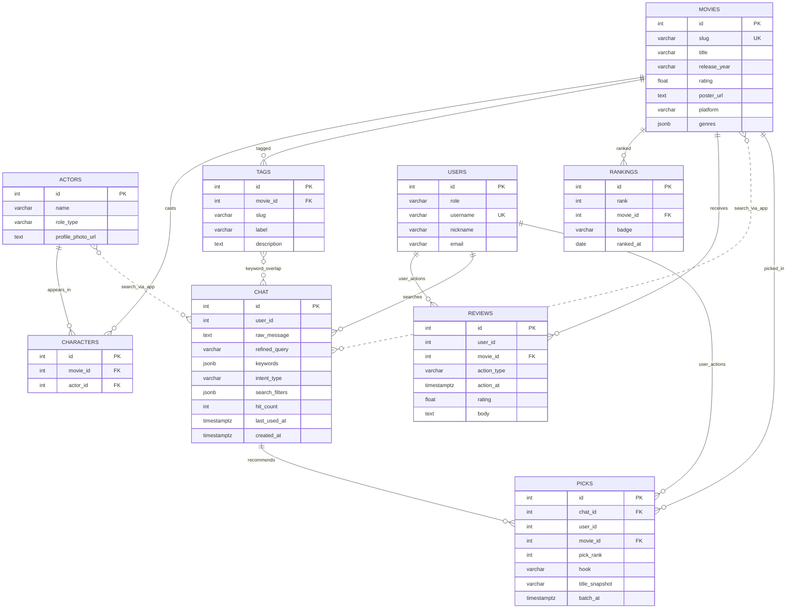

# Mova ERD

`backend/apps/mova` ORM 기준 **Mova DB** 테이블 구조입니다.  
회원(`users`)은 **Secom DB**에 있으며, Mova 테이블의 `user_id`는 논리 참조만 합니다 (DB FK 없음).

## DB 이름·역할 (정리)

| 구분 | 설명 |
|------|------|
| **접두어 `mova_` 없음** | 테이블명은 `movies`, `actors`처럼 **짧은 영문 단수**만 씀. `mova_movies` 같은 중복 접두어는 쓰지 않음. |
| **Mova DB** | 영화·랭킹·태그·AI 의도·리뷰·상호작용. env: `MOVA_DATABASE_URL` 또는 `DATABASE_URL`. |
| **Secom DB** | **회원가입·로그인** (`users` — `role` 컬럼). env: `SECOM_DATABASE_URL` (비우면 Mova와 같은 URL). |
| **`users`는 Secom만** | Mova에 취향용 `users` 테이블은 두지 않음. 리뷰·상호작용의 `user_id` = Secom `users.id` (앱에서 검증, DB FK 없음). |
| **PK 규칙** | 모든 테이블 PK 컬럼명은 `id` (int 자동 증가). 비즈니스 키는 `slug`, `username` 등 별도 UNIQUE. |

Mermaid `erDiagram`은 속성·관계 라벨의 **따옴표·괄호·슬래시** 등에서 파싱 오류가 날 수 있습니다. 필드 설명은 아래 표를 참고하세요.



## DB 범위

| DB | env 변수 | 테이블 |
|----|----------|--------|
| Mova | `MOVA_DATABASE_URL` 또는 `DATABASE_URL` | 아래 8개 (`users` 제외) |
| Secom | `SECOM_DATABASE_URL` (미설정 시 Mova와 동일 URL) | `users` |

## 관계

| 관계 | 카디널리티 | 설명 |
|------|------------|------|
| MOVIES → CHARACTERS | 1:N | 영화–배우·감독 연결 (`movie_id` → `movies.id`, CASCADE) |
| ACTORS → CHARACTERS | 1:N | 동일 중간 테이블 (`actor_id` → `actors.id`, CASCADE) |
| MOVIES ↔ ACTORS | N:M | `characters` 경유, `(movie_id, actor_id)` UNIQUE |
| MOVIES → TAGS | 1:N | 영화별 감성 태그 (`slug`, `label`, `description` 한 행에 포함) |
| TAGS (slug) | (논리 그룹) | 같은 `slug`로 여러 영화에 동일 분위기 태그 가능 — DB FK 없음 |
| MOVIES → RANKINGS | 1:N | HOT 랭킹 (`rank`, `ranked_at`) 조합 UNIQUE |
| MOVIES → REVIEWS | 1:N | 찜·시청·클릭·별점 리뷰 (`action_type`, `movie_id` FK) |
| USERS → REVIEWS | 1:N | **논리 참조** (Mova DB) — `reviews.user_id` = `users.id`, DB FK 없음 |
| USERS → CHAT | 1:N | **논리 참조** — `chat.user_id` = `users.id` (비로그인 채팅은 `user_id` NULL) |
| CHAT → PICKS | 1:N | AI가 한 번에 추천한 작품 (보통 3행, `batch_at`으로 묶음) |
| MOVIES → PICKS | 1:N | 추천된 `movie_id` FK |
| USERS → PICKS | 1:N | **논리 참조** — `picks.user_id` (집계용) |
| REVIEWS (action_type=review) | 1:1 per user+movie | 별점·감상평 — `(user_id, movie_id)` partial UNIQUE |
| CHAT ↔ TAGS | (논리, FK 없음) | `keywords`·`refined_query`·`search_filters.must`로 `tags` 검색 (use) |
| CHAT ↔ ACTORS | (논리, FK 없음) | `search_filters.must.actors`·`similar_to.actors`로 배우명 검색 (use) |
| CHAT → MOVIES | (앱 흐름, FK 없음) | `intent_type`·`search_filters`에 따라 `movies` 조회 — `filter_and`는 AND 교집합 |

### 채팅 추천 흐름 (예: "오늘 우울하니까 재미있는 영화 틀어줘")

```text
사용자 메시지
    → IntentExtraction (refined_query, keywords 예: "재미있는", "우울")
    → chat 저장 (keywords, intent_type, search_filters JSONB)
    → SearchRepository: intent_type·search_filters(must AND) 또는 keywords로 tags·actors·movies 검색
    → Gemini: [태그·DB 카탈로그] 목록에서 3편 picks
    → movies 테이블에 제목 저장·메타 보강
```

| 단계 | 테이블 | 설명 |
|------|--------|------|
| 1. 의도 추출 | (메모리) | "재미있는", "우울" 등 키워드 분리 — **자동으로 tags 행을 만들지는 않음** |
| 2. 의도 이력 | `chat` | `keywords`, `refined_query`, `intent_type`, `search_filters` 저장 |
| 3. 태그 매칭 | `tags` → `movies` | `tags.label` ILIKE `%재미있는%` 등 (`GET /mova/search`와 동일) |
| 4. 추천 | `movies` | Gemini가 3편 제목 반환 후 `movies` upsert |
| 5. 추천 기록 | `picks` | `chat_id` + `movie_id` + 순위·hook 저장 (데이터화) |

**전제:** "재미있는"으로 찾으려면 DB `tags`에 그 `label`(또는 비슷한 문구)이 **어떤 영화에든** 붙어 있어야 합니다. 없으면 검색 결과가 비고 Gemini만으로 추천합니다.

**카탈로그 시드 (tags·genres·출연):** `backend/scripts/seed_mova_recommendation_catalog.py` — `재미있는`, `우울할 때`, `스릴러` 등 `tags.label`, `movies.genres`, `전지현` 등 `actors`+`characters` 초기 데이터.

### tags vs chat (저장 구조)

| | `tags` | `chat` |
|--|--------|--------|
| **역할** | 작품별 **감성 라벨** (`movie_id` FK) | 사용자 **채팅 의도·분류** 로그 |
| **영화 연결** | `movie_id` FK | 없음 — `picks.movie_id`로 결과만 연결 |
| **분류** | 없음 | `intent_type` (`filter_and` / `similar_person` / `mood`) |
| **AND 조건** | 없음 | `search_filters.must` (actors, genres, keywords) |
| **검색 바** | `GET /mova/search` | `POST /mova/chat` — `search_by_filters` 또는 키워드 검색 |

ERD 점선(`CHAT ↔ TAGS` / `CHAT ↔ ACTORS` / `CHAT → MOVIES`)은 DB FK가 아니라 **`search_filters`·`keywords`로 검색하는 use 관계**입니다.

기존 DB에 `intent_type`·`search_filters`가 없으면 `backend/scripts/add_chat_intent_columns.py` 1회 실행.

## 제약·인덱스

| 테이블 | 제약 |
|--------|------|
| `movies` | `slug` UNIQUE |
| `actors` | `(name, role_type)` UNIQUE — `uq_actors_name_role` |
| `characters` | `(movie_id, actor_id)` UNIQUE |
| `tags` | `(movie_id, slug)` UNIQUE — `uq_tags_movie_slug` |
| `rankings` | `(rank, ranked_at)` UNIQUE — `uq_rankings_rank_date` |
| `reviews` | `action_type=review` 시 `(user_id, movie_id)` partial UNIQUE |
| `chat` | `intent_type` 인덱스 · `search_filters` JSONB (스키마 검증은 앱) |
| `users` (Secom) | `username` UNIQUE · `role` = `admin` \| `user` |

## 필드 설명

### movies

| 필드 | 설명 |
|------|------|
| slug | URL·검색용 식별자 (예: `interstellar`, `tmdb-550`, `kofic-20139882`) |
| title | 작품 제목 |
| release_year | 개봉 연도 문자열 |
| rating | 평균 별점 (리뷰 upsert 시 갱신) |
| poster_url | 포스터 URL (TMDB enrich 가능) |
| platform | OTT 힌트 (`netflix`, `disney` 등, nullable) |
| genres | 장르 배열 JSONB |


### actors

| 필드 | 설명 |
|------|------|
| name | 인물 이름 |
| role_type | `director` 또는 `actor` |
| profile_photo_url | 프로필 이미지 URL |


### characters

| 필드 | 설명 |
|------|------|
| movie_id | `movies.id` |
| actor_id | `actors.id` |


### tags (감성 태그, 단일 테이블)

| 필드 | 설명 |
|------|------|
| movie_id | `movies.id` |
| slug | 태그 식별자 (영화 내 UNIQUE, 여러 영화에서 동일 slug 가능) |
| label | 표시용 라벨 (예: 우울할 때 위로되는 영화) |
| description | 태그 설명 |


### rankings

| 필드 | 설명 |
|------|------|
| rank | 순위 1~10 |
| movie_id | `movies.id` |
| badge | `NEW` 등 뱃지 (nullable) |
| ranked_at | 랭킹 기준일 (KOFIC 일간 박스오피스 등) |


### picks (AI 채팅 추천 작품 기록)

| 필드 | 설명 |
|------|------|
| chat_id | `chat.id` — 어떤 검색/채팅 의도에서 나온 추천인지 |
| user_id | `users.id` (로그인 시, Secom 논리 참조) |
| movie_id | `movies.id` — 추천된 작품 |
| pick_rank | 해당 응답 안 순위 1~3 |
| hook | AI 한 줄 추천 이유 |
| title_snapshot | 추천 시점 제목 (스냅샷) |
| batch_at | 같은 응답에서 나온 3편 묶음 시각 |

사용자가 **클릭·찜**한 선택은 `reviews` (`action_type`)로 별도 기록 가능.


### chat (AI 검색·채팅 의도 로그)

| 필드 | 설명 |
|------|------|
| user_id | `users.id` (로그인 시). 비회원은 NULL — 전역 인기 의도로 집계 |
| raw_message | 사용자 원문 (채팅/랜딩 검색 입력) |
| refined_query | AI·규칙으로 정제한 검색 문구 — `tags.label`과 유사하지만 **작품 FK 없음** |
| keywords | 추출 키워드 JSONB 배열 (배우·장르·분위기 등 **전부**, 최대 24개) |
| intent_type | `filter_and` · `similar_person` · `mood` — 검색·추천 분류 (DB FK 없음, 앱 해석) |
| search_filters | JSONB — 아래 구조. `actors`/`movies`/`tags`와 **FK 없음**, 검색 시 use |
| hit_count | 동일 의도 재사용 횟수 |

`search_filters` 예시:

```json
{
  "must": { "actors": ["전지현"], "genres": ["스릴러"], "keywords": [] },
  "similar_to": { "actors": ["전지현"] },
  "match_mode": "all"
}
```

| `intent_type` | `match_mode` | 검색 의미 |
|---------------|--------------|-----------|
| `filter_and` | `all` | `must` 조건 **전부 AND** (교집합) |
| `similar_person` | `any` | `similar_to.actors` 출연작 위주 (넓게) |
| `mood` | `any` | `keywords`·`refined_query` 위주 (OR 검색) |
| last_used_at | 마지막 사용 시각 |
| created_at | 최초 저장 시각 |


### reviews (반응·별점 리뷰 단일 테이블)

| 필드 | 설명 |
|------|------|
| user_id | `users.id` (Secom DB, 앱에서 존재 여부 검증) |
| movie_id | `movies.id` |
| action_type | `favorite`, `watched`, `click`, `not_interested`, **`review`** |
| action_at | 반응·리뷰 시각 (API 리뷰 응답의 `created_at`과 동일) |
| rating | 별점 1~5 (`action_type=review`일 때) |
| body | 감상평 (`review`일 때) |

## ORM 매핑

| 테이블 | 모델 | 경로 |
|--------|------|------|
| `movies` | `MovaMovie` | `mova/app/models/movies_model.py` |
| `actors` | `MovaActor` | `mova/app/models/actors_model.py` |
| `characters` | `MovaCharacter` | `mova/app/models/characters_model.py` |
| `tags` | `MovaTag` | `mova/app/models/tags_model.py` |
| `rankings` | `MovaRanking` | `mova/app/models/rankings_model.py` |
| `chat` | `MovaChat` | `mova/app/models/chat_model.py` |
| `picks` | `MovaPick` | `mova/app/models/picks_model.py` |
| `reviews` | `MovaReview` | `mova/app/models/reviews_model.py` |
| `users` | `User` | `secom/app/models/user_model.py` |

공통 PK 규칙은 [`ENTITY_RULE.md`](ENTITY_RULE.md)를 따릅니다 (`id` int 자동 증감).

## Secom (`users`)

회원가입·로그인은 `backend/apps/secom`. 테이블명 **`users`** (접두어 없음).  
권한은 별도 `user_groups` 없이 **`users.role`** (`admin` / `user`).  
다른 Neon(`SECOM_DATABASE_URL`)에 둘 수 있으며, Mova `create_tables()` 대상이 아닙니다.

기존 DB에 `user_groups`가 남아 있으면 `backend/scripts/merge_user_groups_into_users.py` 1회 실행.

### users

| 필드 | 설명 |
|------|------|
| role | `admin` 또는 `user` (기본 `user`) |
| username | 로그인 ID (UNIQUE) |
| password_hash | 비밀번호 해시 |
| nickname | 표시 이름 |
| email | 이메일 |
| created_at | 가입 시각 |
